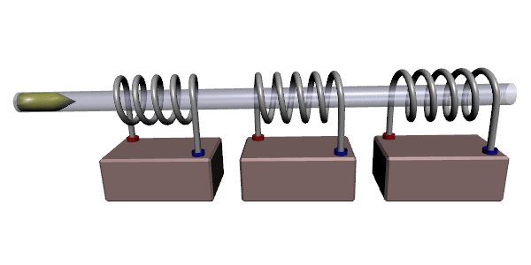

# Arduino coil gun

## What is a coil gun?

A coil gun is a projectile accelerator that uses magnetism to accelerate a piece of magnetic material (iron, cobalt, nickel) at a "high" velocity.

### Bill of materials :

- A bunch of capacitors.
- Copper wire (0,4 mm).
- An iron soldering kit.
- An Arduino uno.
- Arduino display.
- Arduino buttons.
- Leds.
- A platform.
- (Hot) Glue.
- Careful (It may be dangerous).

### In this repository you will find a step by step guide and many theory concepts.
